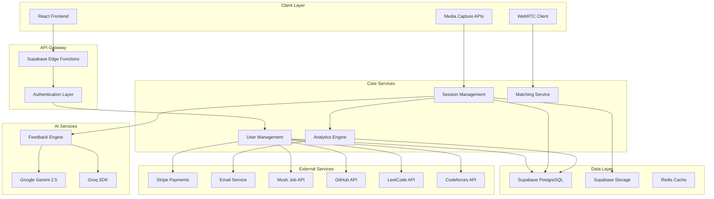

# Design Document: AI Interview Platform

## Overview

The Voke AI-powered interview preparation platform is a comprehensive web application that combines multiple interview practice modes with advanced AI feedback systems. The platform leverages modern web technologies, AI services, and real-time communication to provide personalized interview coaching experiences.

The system architecture follows a modern full-stack approach with React/TypeScript frontend, Supabase backend-as-a-service, and integration with multiple AI providers (Google Gemini, Groq) for intelligent feedback and coaching capabilities.

## Architecture

### High-Level Architecture



### Technology Stack

**Frontend:**
- React 18 with TypeScript for type safety and modern development
- Vite for fast development and optimized builds
- Tailwind CSS for utility-first styling
- shadcn/ui for consistent component library
- WebRTC for peer-to-peer video communication
- Web APIs for media capture and processing

**Backend:**
- Supabase as Backend-as-a-Service providing:
  - PostgreSQL database with real-time subscriptions
  - Authentication and authorization
  - File storage for video/audio recordings
  - Edge Functions for serverless compute
- Redis for session caching and real-time features

**AI Integration:**
- Google Gemini 2.5 Flash for content analysis and feedback generation
- Groq SDK for real-time voice processing and conversation
- Custom feedback algorithms for performance scoring

**Infrastructure:**
- Vercel for frontend deployment and edge computing
- Supabase Cloud for managed backend services
- CDN for global content delivery
- Monitoring and analytics integration

## Components and Interfaces

### Core Components

#### 1. Profile Analysis Engine
Analyzes GitHub repositories and resume content for personalized question generation - the platform's core USP.

```typescript
interface ProfileAnalysisEngine {
  analyzeGitHubProfile(githubUrl: string): Promise<GitHubAnalysis>
  parseResumeContent(resumeFile: File): Promise<ResumeAnalysis>
  generatePersonalizedQuestions(analysis: ProfileAnalysis): Promise<PersonalizedQuestion[]>
  assessSkillLevel(skills: ExtractedSkill[]): Promise<SkillLevelAssessment>
  matchQuestionDifficulty(userLevel: SkillLevel, questions: Question[]): Promise<Question[]>
}

interface GitHubAnalysis {
  repositories: RepositoryAnalysis[]
  languages: LanguageUsage[]
  complexity: ComplexityMetrics
  contributions: ContributionPattern
  skills: ExtractedSkill[]
}

interface ResumeAnalysis {
  extractedSkills: ExtractedSkill[]
  experience: ExperienceEntry[]
  achievements: Achievement[]
  education: EducationEntry[]
  projects: ProjectEntry[]
}

interface PersonalizedQuestion extends Question {
  relevanceReason: string
  specificContext: string
  expectedDepth: QuestionDepth
  relatedProjects: string[]
}
```

#### 2. Coding Platform Integration
Integrates with LeetCode and Codeforces to assess coding skills and adjust difficulty.

```typescript
interface CodingPlatformIntegration {
  connectLeetCodeProfile(userId: string, leetcodeUsername: string): Promise<LeetCodeProfile>
  connectCodeforcesProfile(userId: string, codeforcesHandle: string): Promise<CodeforcesProfile>
  analyzeCodingSkills(profiles: CodingProfile[]): Promise<CodingSkillAssessment>
  recommendTechnicalQuestions(skillLevel: CodingSkillLevel): Promise<TechnicalQuestion[]>
  trackPerformanceCorrelation(userId: string): Promise<PerformanceCorrelation>
}

interface LeetCodeProfile {
  username: string
  totalSolved: number
  easySolved: number
  mediumSolved: number
  hardSolved: number
  acceptanceRate: number
  ranking: number
  recentSubmissions: Submission[]
}

interface CodeforcesProfile {
  handle: string
  rating: number
  maxRating: number
  rank: string
  contestsParticipated: number
  problemsSolved: number
  recentContests: ContestResult[]
}
```

#### 3. Session Manager
Orchestrates all types of interview sessions and manages state transitions.

```typescript
interface SessionManager {
  createSession(type: SessionType, config: SessionConfig): Promise<Session>
  startSession(sessionId: string): Promise<void>
  pauseSession(sessionId: string): Promise<void>
  endSession(sessionId: string): Promise<SessionResult>
  getActiveSession(userId: string): Promise<Session | null>
}

interface Session {
  id: string
  userId: string
  type: SessionType
  status: SessionStatus
  startTime: Date
  endTime?: Date
  config: SessionConfig
  responses: Response[]
  feedback?: Feedback
}

type SessionType = 'video' | 'voice' | 'text' | 'peer'
type SessionStatus = 'created' | 'active' | 'paused' | 'completed' | 'cancelled'
```

#### 4. AI Feedback Engine
Processes user responses and generates personalized feedback using AI services.

```typescript
interface FeedbackEngine {
  analyzeVideoResponse(videoData: Blob, question: string): Promise<VideoFeedback>
  analyzeVoiceResponse(audioData: Blob, context: string): Promise<VoiceFeedback>
  analyzeTextResponse(text: string, question: string): Promise<TextFeedback>
  generateImprovementPlan(userId: string): Promise<ImprovementPlan>
}

interface VideoFeedback {
  bodyLanguage: BodyLanguageAnalysis
  eyeContact: EyeContactAnalysis
  facialExpressions: FacialExpressionAnalysis
  overallScore: number
  recommendations: string[]
}

interface VoiceFeedback {
  clarity: number
  pace: number
  confidence: number
  contentRelevance: number
  suggestions: string[]
}

interface TextFeedback {
  structure: number
  relevance: number
  completeness: number
  clarity: number
  keyPoints: string[]
  improvements: string[]
}
```

#### 5. User Management System
Handles user authentication, profiles, and subscription management.

```typescript
interface UserManager {
  createUser(userData: CreateUserRequest): Promise<User>
  updateProfile(userId: string, updates: ProfileUpdate): Promise<User>
  getUser(userId: string): Promise<User>
  updateSubscription(userId: string, plan: SubscriptionPlan): Promise<Subscription>
  checkFeatureAccess(userId: string, feature: Feature): Promise<boolean>
}

interface User {
  id: string
  email: string
  profile: UserProfile
  subscription: Subscription
  preferences: UserPreferences
  createdAt: Date
  lastActive: Date
}

interface UserProfile {
  firstName: string
  lastName: string
  targetRole: string
  experienceLevel: ExperienceLevel
  careerGoals: string[]
  skills: string[]
}
```

#### 6. Analytics Dashboard
Tracks user progress and generates insights for improvement.

```typescript
interface AnalyticsDashboard {
  getUserMetrics(userId: string, timeRange: TimeRange): Promise<UserMetrics>
  getProgressTrends(userId: string): Promise<ProgressTrend[]>
  generateInsights(userId: string): Promise<Insight[]>
  compareWithPeers(userId: string): Promise<PeerComparison>
}

interface UserMetrics {
  totalSessions: number
  averageScore: number
  improvementRate: number
  streakDays: number
  skillBreakdown: SkillMetric[]
  recentActivity: ActivitySummary[]
}

interface ProgressTrend {
  skill: string
  dataPoints: { date: Date; score: number }[]
  trend: 'improving' | 'stable' | 'declining'
}
```

#### 7. Peer Matching Service
Connects users for peer interview practice sessions.

```typescript
interface PeerMatchingService {
  findMatch(userId: string, preferences: MatchPreferences): Promise<Match | null>
  createPeerSession(match: Match): Promise<PeerSession>
  handleSessionEnd(sessionId: string, feedback: MutualFeedback): Promise<void>
  updateUserRating(userId: string, rating: number): Promise<void>
}

interface Match {
  user1: string
  user2: string
  compatibility: number
  preferences: MatchPreferences
  estimatedWaitTime: number
}

interface PeerSession extends Session {
  participants: [string, string]
  currentInterviewer: string
  webrtcConnection: WebRTCConnection
  mutualFeedback?: MutualFeedback
}
```

#### 8. Learning Path Engine
Manages structured learning experiences and adaptive content delivery.

```typescript
interface LearningPathEngine {
  getAvailablePaths(userId: string): Promise<LearningPath[]>
  enrollUser(userId: string, pathId: string): Promise<Enrollment>
  getNextActivity(userId: string, pathId: string): Promise<Activity>
  recordCompletion(userId: string, activityId: string, result: ActivityResult): Promise<void>
  generateCertificate(userId: string, pathId: string): Promise<Certificate>
}

interface LearningPath {
  id: string
  title: string
  description: string
  targetRole: string
  difficulty: Difficulty
  estimatedDuration: number
  modules: Module[]
  prerequisites: string[]
}

interface Module {
  id: string
  title: string
  activities: Activity[]
  requiredScore: number
  unlockConditions: UnlockCondition[]
}
```

#### 9. Job Matching Engine
Integrates with Mush API to provide intelligent job recommendations based on interview performance.

```typescript
interface JobMatchingEngine {
  calculateInterviewScore(userId: string): Promise<InterviewScore>
  fetchJobOpportunities(criteria: JobCriteria): Promise<JobListing[]>
  matchJobsToUser(userId: string): Promise<JobMatch[]>
  rankJobsByCompatibility(jobs: JobListing[], userProfile: UserProfile): Promise<RankedJob[]>
  notifyNewMatches(userId: string): Promise<void>
}

interface JobMatch {
  job: JobListing
  compatibilityScore: number
  matchReasons: string[]
  requiredSkills: string[]
  skillGaps: string[]
}

interface InterviewScore {
  overall: number
  technical: number
  behavioral: number
  communication: number
  confidence: number
  breakdown: SkillScore[]
}
```

#### 10. Question Bank Manager
Manages the comprehensive library of 1800+ interview questions with advanced categorization.

```typescript
interface QuestionBankManager {
  getQuestionsByCategory(category: QuestionCategory, filters: QuestionFilters): Promise<Question[]>
  getCompanyQuestions(companyId: string, role?: string): Promise<CompanyQuestion[]>
  searchQuestions(query: string, filters: QuestionFilters): Promise<Question[]>
  trackQuestionPerformance(userId: string, questionId: string, performance: QuestionPerformance): Promise<void>
  recommendQuestions(userId: string, count: number): Promise<Question[]>
  addUserContribution(question: UserContributedQuestion): Promise<void>
}

interface CompanyQuestion extends Question {
  company: string
  year: number
  interviewRound: 'screening' | 'technical' | 'behavioral' | 'final'
  verified: boolean
  difficulty: Difficulty
}

interface QuestionFilters {
  difficulty?: Difficulty[]
  categories?: string[]
  companies?: string[]
  skills?: string[]
  timeRange?: TimeRange
}
```

#### 11. AI Playground Assistant
Provides interactive coaching and guidance in the playground environment.

```typescript
interface PlaygroundAssistant {
  startPlaygroundSession(userId: string): Promise<PlaygroundSession>
  processUserMessage(sessionId: string, message: string): Promise<AssistantResponse>
  provideInterviewTip(context: InterviewContext): Promise<InterviewTip>
  suggestPracticeArea(userId: string): Promise<PracticeRecommendation>
  analyzeUserProgress(userId: string): Promise<ProgressInsight[]>
  adaptCoachingStyle(userId: string, preferences: CoachingPreferences): Promise<void>
}

interface PlaygroundSession {
  id: string
  userId: string
  startTime: Date
  endTime?: Date
  conversationHistory: ConversationMessage[]
  currentContext: InterviewContext
  assistantPersonality: AssistantPersonality
  practiceAreas: string[]
  sessionSummary?: SessionSummary
}

interface AssistantResponse {
  message: string
  suggestions: string[]
  resources: Resource[]
  nextSteps: string[]
  adaptedToUserLevel: boolean
}

interface CoachingPreferences {
  experienceLevel: ExperienceLevel
  communicationStyle: 'direct' | 'supportive' | 'detailed' | 'concise'
  focusAreas: string[]
  preferredFeedbackType: 'immediate' | 'summary' | 'detailed'
}
```

#### 12. Company-Specific Question Manager
Manages company-specific interview questions and insights.

```typescript
interface CompanyQuestionManager {
  getCompanyQuestions(companyId: string, filters: CompanyQuestionFilters): Promise<CompanyQuestion[]>
  getCompanyInsights(companyId: string): Promise<CompanyInterviewInsights>
  organizeQuestionsByRound(companyId: string, role?: string): Promise<QuestionsByRound>
  addUserContribution(question: UserContributedQuestion): Promise<ContributionResult>
  verifyQuestion(questionId: string, verification: QuestionVerification): Promise<void>
  getInterviewPatterns(companyId: string): Promise<InterviewPattern[]>
  updateQuestionDatabase(updates: QuestionDatabaseUpdate[]): Promise<void>
}

interface CompanyQuestion extends Question {
  company: string
  companyId: string
  year: number
  interviewRound: 'screening' | 'technical' | 'behavioral' | 'system_design' | 'final'
  role: string
  verified: boolean
  verificationCount: number
  successRate: number
  difficulty: Difficulty
  reportedBy: string[]
  lastUpdated: Date
}

interface CompanyInterviewInsights {
  companyId: string
  companyName: string
  averageInterviewRounds: number
  commonQuestionTypes: QuestionType[]
  difficultyDistribution: DifficultyDistribution
  successTips: string[]
  interviewProcess: InterviewProcessStep[]
  culturalFit: CulturalFitCriteria[]
}

interface QuestionsByRound {
  screening: CompanyQuestion[]
  technical: CompanyQuestion[]
  behavioral: CompanyQuestion[]
  systemDesign: CompanyQuestion[]
  final: CompanyQuestion[]
}

interface UserContributedQuestion {
  userId: string
  company: string
  question: string
  interviewRound: string
  role: string
  year: number
  additionalContext?: string
}

interface InterviewPattern {
  pattern: string
  frequency: number
  applicableRoles: string[]
  difficulty: Difficulty
  preparationTips: string[]
}

### External Service Interfaces
```typescript
interface AIServiceProvider {
  analyzeContent(content: string, type: AnalysisType): Promise<AnalysisResult>
  generateQuestions(context: QuestionContext): Promise<Question[]>
  processVoiceInput(audioData: Blob): Promise<VoiceProcessingResult>
  generateVoiceResponse(text: string, voice: VoiceConfig): Promise<AudioBlob>
}

interface GeminiProvider extends AIServiceProvider {
  model: 'gemini-2.5-flash'
  maxTokens: number
  temperature: number
}

interface GroqProvider extends AIServiceProvider {
  model: string
  realTimeProcessing: boolean
  latencyOptimized: boolean
}
```

## Data Models

### Core Entities

#### User Data Model
```typescript
interface User {
  id: string                    // UUID primary key
  email: string                 // Unique email address
  passwordHash?: string         // Hashed password (optional for OAuth)
  profile: UserProfile
  subscription: Subscription
  preferences: UserPreferences
  stats: UserStats
  createdAt: Date
  updatedAt: Date
  lastLoginAt: Date
}

interface UserProfile {
  firstName: string
  lastName: string
  avatarUrl?: string
  targetRole: string
  experienceLevel: 'entry' | 'mid' | 'senior' | 'executive'
  industry: string
  location?: string
  careerGoals: string[]
  skills: Skill[]
  resume?: ResumeData
}

interface Subscription {
  plan: 'free' | 'basic' | 'premium' | 'enterprise'
  status: 'active' | 'cancelled' | 'expired' | 'trial'
  startDate: Date
  endDate?: Date
  stripeCustomerId?: string
  stripeSubscriptionId?: string
}
```

#### Session Data Model
```typescript
interface Session {
  id: string
  userId: string
  type: SessionType
  status: SessionStatus
  config: SessionConfig
  startTime: Date
  endTime?: Date
  duration?: number             // in seconds
  responses: Response[]
  feedback?: Feedback
  score?: number
  metadata: SessionMetadata
}

interface Response {
  id: string
  sessionId: string
  questionId: string
  content: ResponseContent
  timestamp: Date
  duration: number
  score?: number
}

interface ResponseContent {
  text?: string
  audioUrl?: string
  videoUrl?: string
  metadata: {
    fileSize?: number
    duration?: number
    quality?: string
  }
}
```

#### Question Bank Model
```typescript
interface Question {
  id: string
  category: QuestionCategory
  difficulty: Difficulty
  text: string
  followUpQuestions?: string[]
  expectedKeywords: string[]
  scoringCriteria: ScoringCriteria
  metadata: QuestionMetadata
  companySpecific?: CompanyQuestionData
}

interface CompanyQuestionData {
  company: string
  year: number
  interviewRound: InterviewRound
  verified: boolean
  verificationCount: number
  successRate: number
}

interface QuestionCategory {
  name: string
  subcategory?: string
  targetRoles: string[]
  skills: string[]
}

interface ScoringCriteria {
  contentRelevance: number      // weight 0-1
  structureClarity: number      // weight 0-1
  completeness: number          // weight 0-1
  keywordMatching: number       // weight 0-1
}
```

#### Profile Analysis Data Model
```typescript
interface ProfileAnalysis {
  userId: string
  githubAnalysis?: GitHubAnalysis
  resumeAnalysis?: ResumeAnalysis
  codingPlatforms: CodingPlatformData[]
  skillLevelAssessment: SkillLevelAssessment
  personalizedQuestions: PersonalizedQuestion[]
  lastUpdated: Date
}

interface GitHubAnalysis {
  username: string
  repositories: RepositoryData[]
  languages: LanguageUsage[]
  totalCommits: number
  complexity: ComplexityMetrics
  skills: ExtractedSkill[]
  projectTypes: ProjectType[]
}

interface RepositoryData {
  name: string
  description: string
  language: string
  stars: number
  complexity: number
  technologies: string[]
  lastActivity: Date
}

interface CodingPlatformData {
  platform: 'leetcode' | 'codeforces'
  username: string
  rating: number
  problemsSolved: number
  skillLevel: CodingSkillLevel
  strengths: string[]
  weaknesses: string[]
}

interface SkillLevelAssessment {
  overall: SkillLevel
  technical: SkillLevel
  algorithmic: SkillLevel
  systemDesign: SkillLevel
  breakdown: SkillBreakdown[]
}
```

#### Company-Specific Question Data Model
```typescript
interface CompanyQuestionData {
  id: string
  companyId: string
  companyName: string
  question: string
  category: QuestionCategory
  difficulty: Difficulty
  interviewRound: InterviewRound
  targetRole: string
  year: number
  verified: boolean
  verificationCount: number
  successRate: number
  reportedBy: string[]
  userContributions: UserContribution[]
  lastUpdated: Date
  metadata: CompanyQuestionMetadata
}

interface CompanyQuestionMetadata {
  interviewDuration: number
  followUpQuestions: string[]
  expectedSkills: string[]
  commonMistakes: string[]
  preparationTips: string[]
  relatedQuestions: string[]
}

interface UserContribution {
  userId: string
  contributionDate: Date
  verified: boolean
  additionalContext?: string
  helpfulVotes: number
}

interface CompanyInterviewData {
  companyId: string
  companyName: string
  industry: string
  size: CompanySize
  interviewProcess: InterviewProcessData
  questionsByRole: Map<string, CompanyQuestion[]>
  insights: CompanyInsights
  lastUpdated: Date
}

interface InterviewProcessData {
  averageRounds: number
  typicalDuration: number
  processSteps: ProcessStep[]
  decisionTimeline: string
  feedbackProvided: boolean
}

interface CompanyInsights {
  culturalValues: string[]
  interviewStyle: 'formal' | 'casual' | 'mixed'
  technicalFocus: string[]
  behavioralEmphasis: string[]
  successFactors: string[]
  commonRejectionReasons: string[]
}

type CompanySize = 'startup' | 'small' | 'medium' | 'large' | 'enterprise'
type InterviewRound = 'screening' | 'technical' | 'behavioral' | 'system_design' | 'final' | 'onsite'
```

#### Enhanced Job Matching Data Model
```typescript
interface EnhancedJobListing extends JobListing {
  interviewProcess: InterviewProcessInfo
  requiredInterviewSkills: InterviewSkill[]
  companyInterviewStyle: InterviewStyle
  expectedQuestionTypes: QuestionType[]
  interviewDifficulty: Difficulty
  successCriteria: SuccessCriteria[]
}

interface InterviewProcessInfo {
  rounds: number
  typicalQuestions: string[]
  assessmentMethods: AssessmentMethod[]
  timeToDecision: string
  interviewFormat: 'remote' | 'onsite' | 'hybrid'
}

interface InterviewSkill {
  skill: string
  importance: 'critical' | 'important' | 'nice-to-have'
  assessmentMethod: 'technical' | 'behavioral' | 'case-study' | 'presentation'
  weight: number
}

interface JobMatchWithInterviewReadiness extends JobMatch {
  interviewReadinessScore: number
  skillGapAnalysis: SkillGapAnalysis
  recommendedPreparation: PreparationPlan
  estimatedSuccessRate: number
  interviewStrengths: string[]
  interviewWeaknesses: string[]
}

interface SkillGapAnalysis {
  criticalGaps: SkillGap[]
  minorGaps: SkillGap[]
  strengths: SkillStrength[]
  overqualifications: string[]
}

interface PreparationPlan {
  estimatedHours: number
  priorityAreas: string[]
  recommendedSessions: SessionRecommendation[]
  practiceQuestions: Question[]
  learningResources: Resource[]
}

type AssessmentMethod = 'coding' | 'system_design' | 'behavioral' | 'case_study' | 'presentation' | 'whiteboard'
type InterviewStyle = 'technical_heavy' | 'behavioral_focus' | 'balanced' | 'case_study' | 'practical'
```
```

#### Playground Session Data Model
```typescript
interface PlaygroundSession {
  id: string
  userId: string
  startTime: Date
  endTime?: Date
  conversationHistory: PlaygroundMessage[]
  topicsDiscussed: string[]
  tipsProvided: InterviewTip[]
  practiceAreas: string[]
  sessionSummary?: SessionSummary
}

interface PlaygroundMessage {
  id: string
  sender: 'user' | 'assistant'
  content: string
  timestamp: Date
  messageType: 'question' | 'tip' | 'feedback' | 'general'
  relatedTopics: string[]
}

interface InterviewTip {
  id: string
  category: TipCategory
  title: string
  content: string
  applicableScenarios: string[]
  difficulty: Difficulty
  effectiveness: number
}
```

#### Analytics Data Model
```typescript
interface UserMetrics {
  userId: string
  date: Date
  sessionsCompleted: number
  averageScore: number
  timeSpent: number             // in minutes
  skillScores: SkillScore[]
  improvementAreas: string[]
  achievements: Achievement[]
}

interface SkillScore {
  skill: string
  score: number                 // 0-100
  trend: 'improving' | 'stable' | 'declining'
  sessionsCount: number
  lastUpdated: Date
}

interface Achievement {
  id: string
  type: 'streak' | 'score' | 'completion' | 'improvement'
  title: string
  description: string
  earnedAt: Date
  badgeUrl?: string
}
```

#### Learning Path Data Model
```typescript
interface LearningPath {
  id: string
  title: string
  description: string
  targetRole: string
  difficulty: Difficulty
  estimatedHours: number
  modules: Module[]
  prerequisites: string[]
  completionRate: number
  rating: number
  createdAt: Date
  updatedAt: Date
}

interface Module {
  id: string
  pathId: string
  title: string
  description: string
  order: number
  activities: Activity[]
  requiredScore: number
  unlockConditions: UnlockCondition[]
}

interface Activity {
  id: string
  moduleId: string
  type: ActivityType
  title: string
  description: string
  content: ActivityContent
  estimatedMinutes: number
  requiredForCompletion: boolean
}

type ActivityType = 'video_practice' | 'voice_session' | 'text_interview' | 'reading' | 'quiz'
```

### Database Schema Considerations

#### Indexing Strategy
- Primary keys on all entities (UUID)
- Composite indexes on frequently queried combinations:
  - (userId, sessionType, createdAt) for session queries
  - (userId, date) for analytics queries
  - (targetRole, difficulty) for question filtering
- Full-text search indexes on question content and user profiles

#### Data Partitioning
- Sessions partitioned by date for efficient archival
- Analytics data partitioned by month for performance
- User data kept in single partition for consistency

#### Caching Strategy
- User profiles and preferences cached in Redis
- Question banks cached with TTL of 1 hour
- Session state cached during active sessions
- Analytics summaries cached with daily refresh

## Correctness Properties

*A property is a characteristic or behavior that should hold true across all valid executions of a system—essentially, a formal statement about what the system should do. Properties serve as the bridge between human-readable specifications and machine-verifiable correctness guarantees.*

### Property 1: GitHub Profile Analysis and Data Extraction
*For any* valid GitHub profile URL, the Platform should successfully scan repositories, extract technical skills, programming languages, and project complexity metrics.
**Validates: Requirements 1.1, 1.2**

### Property 2: Resume Content Parsing and Skill Extraction
*For any* uploaded resume file, the AI_Coach should parse content and extract claimed skills, experience, and achievements in a structured format.
**Validates: Requirements 1.3**

### Property 3: Personalized Question Generation from Profile Data
*For any* combination of GitHub analysis and resume data, the Platform should generate interview questions that are specifically relevant to the user's projects, technologies, and claims.
**Validates: Requirements 1.4, 1.6**

### Property 4: Skill Level Assessment and Question Difficulty Matching
*For any* user profile with GitHub contributions and resume experience, the Platform should assess skill level and match question difficulty appropriately.
**Validates: Requirements 1.5**

### Property 5: Coding Platform Integration and Statistics Retrieval
*For any* valid LeetCode or Codeforces username, the Platform should successfully connect, fetch solving statistics, and analyze performance metrics.
**Validates: Requirements 2.1, 2.2, 2.3**

### Property 6: Technical Question Difficulty Adjustment
*For any* coding platform performance data, the Platform should adjust technical interview question difficulty and recommend appropriate practice problems.
**Validates: Requirements 2.4, 2.5**

### Property 7: Performance Correlation Tracking
*For any* user with both coding platform data and interview session history, the Platform should track correlations to improve recommendations.
**Validates: Requirements 2.6**

### Property 8: Video Session Initialization and Recording
*For any* video practice session start, the Platform should activate camera, display questions, and capture audio/video data at minimum 720p resolution.
**Validates: Requirements 3.1, 3.2**

### Property 9: Video Analysis and Feedback Generation
*For any* completed video recording, the AI_Coach should analyze body language, eye contact, posture, and facial expressions, then provide feedback within 30 seconds.
**Validates: Requirements 3.3, 3.4**

### Property 10: Video Storage and Comparison Features
*For any* video recording, the Platform should store it securely and provide side-by-side comparison with previous attempts when reviewing.
**Validates: Requirements 3.5, 3.6**

### Property 11: Voice Session Real-time Interaction
*For any* voice session initiation, the AI_Coach should begin speaking within 2 seconds and maintain conversational flow with adaptive questioning.
**Validates: Requirements 4.1, 4.2**

### Property 12: Speech Processing and Clarity Handling
*For any* user speech input, the Platform should process speech-to-text with 95% accuracy for clear speech and request clarification for unclear speech.
**Validates: Requirements 4.3, 4.4**

### Property 13: Voice Feedback and Performance Reporting
*For any* voice session, the AI_Coach should provide real-time feedback on pace, clarity, and content, then generate comprehensive performance reports.
**Validates: Requirements 4.5, 4.6**

### Property 14: Text Interview Personalization and Timer Management
*For any* text interview session, the AI_Coach should generate personalized questions and display configurable countdown timers (30 seconds to 5 minutes).
**Validates: Requirements 5.1, 5.2**

### Property 15: Text Input Handling and Automatic Progression
*For any* active timer in text interviews, the Platform should allow text input with character/word counts and automatically save responses when time expires.
**Validates: Requirements 5.3, 5.4**

### Property 16: Text Response Analysis and Session Feedback
*For any* text response, the AI_Coach should analyze quality, relevance, and structure, then provide detailed scoring and improvement suggestions.
**Validates: Requirements 5.5, 5.6**

### Property 17: Peer Matching and Connection Establishment
*For any* peer practice request, the Platform should match users within 60 seconds or queue them, then establish WebRTC connections for matched pairs.
**Validates: Requirements 6.1, 6.2**

### Property 18: Peer Session Management and Role Control
*For any* peer session, the Platform should provide questions, assign roles, allow role switching, and manage session state throughout.
**Validates: Requirements 6.3, 6.4**

### Property 19: Mutual Feedback Collection and Optimization
*For any* completed peer session, the Platform should prompt both users for mutual feedback and track completion rates for matching optimization.
**Validates: Requirements 6.5, 6.6**

### Property 20: Analytics Dashboard and Real-time Updates
*For any* user session data, the Analytics_Dashboard should display performance metrics with visual charts and update within 5 seconds of session completion.
**Validates: Requirements 7.1, 7.2**

### Property 21: Trend Analysis and Improvement Planning
*For any* user performance history, the Feedback_Engine should identify trends, detect patterns, and generate personalized improvement plans.
**Validates: Requirements 7.3, 7.4**

### Property 22: Peer Comparison and Progress Reporting
*For any* user analytics request, the Platform should show comparative performance against anonymized peers and send weekly progress reports.
**Validates: Requirements 7.5, 7.6**

### Property 23: Learning Path Availability and Structure
*For any* common role category, the Platform should offer structured Learning_Paths with activities, milestones, and proper sequencing.
**Validates: Requirements 8.1, 8.2**

### Property 24: Progress Tracking and Content Unlocking
*For any* Learning_Path enrollment, the Platform should track completion progress, unlock advanced content based on performance, and provide certificates.
**Validates: Requirements 8.3, 8.4**

### Property 25: Adaptive Learning and Path Recommendations
*For any* user performance and feedback data, the AI_Coach should adapt Learning_Path difficulty and recommend relevant paths based on profile and goals.
**Validates: Requirements 8.5, 8.6**

### Property 26: Resume Builder Templates and Real-time Optimization
*For any* industry and role combination, the Resume_Builder should provide optimized templates and real-time suggestions as content is entered.
**Validates: Requirements 9.1, 9.2**

### Property 27: Resume Analysis and Export Generation
*For any* resume content and job description pair, the Platform should analyze compatibility, suggest improvements, and generate multiple export formats.
**Validates: Requirements 9.3, 9.4**

### Property 28: Job Recommendations and Board Integration
*For any* user skills and preferences, the Platform should recommend relevant job opportunities and integrate with major job boards for streamlined applications.
**Validates: Requirements 9.5, 9.6**

### Property 29: Community Challenges and Leaderboard Updates
*For any* daily/weekly challenge period, the Community_Hub should display themed challenges and update leaderboards within 10 seconds of completion.
**Validates: Requirements 10.1, 10.2**

### Property 30: Community Organization and Achievement System
*For any* skill level and category combination, the Platform should maintain separate leaderboards, provide forums, and award badges for milestone achievements.
**Validates: Requirements 10.3, 10.4, 10.5**

### Property 31: Content Moderation and Environment Maintenance
*For any* community content submission, the Platform should apply moderation to maintain a professional and supportive environment.
**Validates: Requirements 10.6**

### Property 32: Multi-method Authentication and Verification
*For any* registration attempt via email, Google, or LinkedIn OAuth, the Platform should support the method and require email verification before full access.
**Validates: Requirements 11.1, 11.2**

### Property 33: Profile Customization and Secure Storage
*For any* user profile data, the Platform should allow setting career goals, target roles, and experience levels while encrypting and securely storing all information.
**Validates: Requirements 11.3, 11.4**

### Property 34: Profile Updates and Recommendation Adaptation
*For any* user profile update, the AI_Coach should adapt recommendations within 24 hours and provide data export functionality for privacy compliance.
**Validates: Requirements 11.5, 11.6**

### Property 35: Subscription Tiers and Feature Access Control
*For any* subscription tier (free, basic, premium), the Platform should properly control feature access, provide clear usage limits, and display upgrade prompts.
**Validates: Requirements 12.1, 12.4**

### Property 36: Payment Processing and Subscription Management
*For any* subscription option (monthly/annual), the Platform should support secure payment processing through Stripe and immediately unlock features upon upgrade.
**Validates: Requirements 12.2, 12.3, 12.5**

### Property 37: Subscription Expiration and Data Preservation
*For any* subscription expiration, the Platform should gracefully downgrade access while preserving user data.
**Validates: Requirements 12.6**

### Property 38: Performance Standards and User Experience
*For any* page load request on standard broadband, the Platform should load within 2 seconds and provide loading indicators with estimated completion times for AI processing.
**Validates: Requirements 13.1, 13.3**

### Property 39: Error Handling and Recovery Options
*For any* system error occurrence, the Platform should display helpful error messages and provide recovery options to maintain user experience.
**Validates: Requirements 13.5**

### Property 40: Responsive Design and Device Compatibility
*For any* device type (desktop, tablet, mobile), the Platform should provide responsive design with touch interactions and mobile-specific UI patterns.
**Validates: Requirements 14.1, 14.2**

### Property 41: Accessibility Standards and Assistive Technology Support
*For any* user with accessibility needs, the Platform should meet WCAG 2.1 AA standards, provide keyboard navigation, and support screen readers.
**Validates: Requirements 14.3, 14.5, 14.6**

### Property 42: Mobile Optimization and Bandwidth Adaptation
*For any* mobile device usage, the Platform should optimize video/audio quality based on available bandwidth.
**Validates: Requirements 14.4**

### Property 43: Interview Performance Scoring and Job Integration
*For any* completed interview sessions, the Platform should calculate overall performance scores and integrate with Mush API to fetch relevant job opportunities.
**Validates: Requirements 15.1, 15.2**

### Property 44: Job Filtering and Compatibility Ranking
*For any* job matching request, the Platform should filter jobs based on interview scores and skill assessments, then rank by compatibility with demonstrated performance.
**Validates: Requirements 15.3, 15.4**

### Property 45: Job Recommendation Explanations and Notifications
*For any* job recommendation, the Platform should provide detailed explanations for why jobs are recommended and notify users within 24 hours of new matches.
**Validates: Requirements 15.5, 15.6**

### Property 46: Question Bank Size and Categorization
*For any* question library access, the Platform should maintain at least 1800 questions categorized by role type, difficulty level, and skill area.
**Validates: Requirements 16.1, 16.2**

### Property 47: Question Search and Performance Tracking
*For any* question search request, the Platform should provide filtering options and track user practice performance on individual questions.
**Validates: Requirements 16.3, 16.4**

### Property 48: Question Recommendations Based on Weak Areas
*For any* user with practice history, the Platform should recommend questions based on weak areas and target role requirements.
**Validates: Requirements 16.5**

### Property 49: AI Playground Availability and Assistant Interaction
*For any* playground mode entry, the Platform should provide an AI assistant available for real-time conversation, guidance, and interview tips.
**Validates: Requirements 17.1, 17.2, 17.3**

### Property 50: Playground Practice Flexibility and Adaptive Coaching
*For any* playground session, the Platform should allow practice of any question type without time limits while the AI_Assistant adapts coaching style to user experience level.
**Validates: Requirements 17.4, 17.5**

### Property 51: Playground Session Persistence
*For any* playground activity, the Platform should save sessions for later review and analysis.
**Validates: Requirements 17.6**

### Property 52: Company Question Database and Organization
*For any* major company selection, the Platform should maintain previous year interview questions organized by role, year, and interview round.
**Validates: Requirements 18.1, 18.2, 18.3**

### Property 53: Company Interview Insights and User Contributions
*For any* company data, the Platform should provide insights about interview patterns and expectations while allowing users to contribute and verify questions.
**Validates: Requirements 18.4, 18.6**

## Error Handling

### Error Categories and Strategies

#### 1. AI Service Failures
- **Timeout Handling**: Implement circuit breakers for AI service calls with fallback to cached responses
- **Rate Limiting**: Handle API rate limits gracefully with queuing and retry mechanisms
- **Service Degradation**: Provide alternative feedback when AI services are unavailable

#### 2. Media Processing Errors
- **Camera/Microphone Access**: Graceful fallback when permissions are denied
- **Recording Failures**: Automatic retry with quality degradation if needed
- **Upload Failures**: Chunked upload with resume capability for large files

#### 3. Real-time Communication Errors
- **WebRTC Connection Failures**: Automatic reconnection attempts with fallback to text-only mode
- **Network Instability**: Adaptive quality adjustment and connection recovery
- **Peer Disconnection**: Graceful session termination with partial session saving

#### 4. Data Consistency Errors
- **Database Conflicts**: Optimistic locking with conflict resolution strategies
- **Cache Invalidation**: Automatic cache refresh on data inconsistencies
- **Backup Failures**: Multiple backup strategies with monitoring and alerts

#### 5. Authentication and Authorization Errors
- **OAuth Failures**: Clear error messages with alternative authentication options
- **Session Expiration**: Automatic token refresh with seamless user experience
- **Permission Denied**: Contextual upgrade prompts for premium features

### Error Recovery Patterns

#### Retry Strategies
```typescript
interface RetryConfig {
  maxAttempts: number
  backoffStrategy: 'exponential' | 'linear' | 'fixed'
  baseDelay: number
  maxDelay: number
  retryableErrors: ErrorType[]
}
```

#### Circuit Breaker Pattern
```typescript
interface CircuitBreakerConfig {
  failureThreshold: number
  recoveryTimeout: number
  monitoringWindow: number
  fallbackStrategy: FallbackStrategy
}
```

## Testing Strategy

### Dual Testing Approach

The testing strategy employs both unit testing and property-based testing to ensure comprehensive coverage:

- **Unit tests**: Verify specific examples, edge cases, and error conditions
- **Property tests**: Verify universal properties across all inputs
- Both approaches are complementary and necessary for comprehensive coverage

### Unit Testing Focus Areas

Unit tests should concentrate on:
- Specific examples that demonstrate correct behavior
- Integration points between components (AI services, external APIs)
- Edge cases and error conditions (network failures, invalid inputs)
- Mock external service interactions (GitHub API, LeetCode API, Mush API)
- Authentication and authorization flows
- Payment processing scenarios
- Media processing edge cases

### Property-Based Testing Configuration

**Library Selection**: Use `fast-check` for TypeScript/JavaScript property-based testing

**Test Configuration**:
- Minimum 100 iterations per property test due to randomization
- Each property test must reference its design document property
- Tag format: **Feature: ai-interview-platform, Property {number}: {property_text}**

**Property Test Implementation**:
- Each correctness property must be implemented by a single property-based test
- Tests should generate diverse inputs to validate universal properties
- Focus on invariants, round-trip properties, and metamorphic relationships

### Testing Pyramid Structure

#### Unit Tests (50%)
- Component-level functionality testing
- Service layer business logic validation
- Data model validation and serialization
- Error handling scenarios and edge cases
- Mock external service interactions
- Authentication and authorization flows

#### Integration Tests (35%)
- API endpoint testing with real database
- External service integration (GitHub, LeetCode, Codeforces, Mush)
- WebRTC connection establishment and management
- AI service integration (Gemini, Groq)
- Payment processing with Stripe
- Email service integration
- File upload and storage testing

#### Property-Based Tests (15%)
- Universal correctness properties validation
- Cross-component behavior verification
- Data consistency across operations
- Performance characteristic validation
- Round-trip properties for serialization/parsing
- Invariant preservation across transformations

### Specific Testing Areas

#### AI Service Testing
- Mock AI responses for consistent testing
- Test fallback mechanisms when AI services fail
- Validate response parsing and error handling
- Test rate limiting and retry mechanisms

#### Media Processing Testing
- Test video/audio capture and processing
- Validate quality standards (720p video, 95% speech accuracy)
- Test file upload and storage mechanisms
- Validate media format conversions

#### Real-time Communication Testing
- Test WebRTC connection establishment
- Validate peer matching algorithms
- Test connection recovery and fallback mechanisms
- Validate session state management

#### Performance Testing
- Load testing for concurrent users (up to 10,000)
- Response time validation (2-second page loads, 30-second AI feedback)
- Memory usage monitoring during media processing
- Database query performance optimization

#### Security Testing
- Authentication and authorization testing
- Data encryption validation
- Input sanitization and validation
- CSRF and XSS protection testing
- Payment security compliance

### Continuous Testing Strategy

#### Pre-commit Testing
- Unit tests for changed components
- Linting and type checking
- Basic integration tests
- Security vulnerability scanning

#### CI/CD Pipeline Testing
- Full test suite execution
- Property-based tests with extended iterations (1000+ per property)
- Integration tests with external service mocks
- Performance regression testing
- Accessibility compliance testing (WCAG 2.1 AA)

#### Staging Environment Testing
- End-to-end user journey testing
- Real external service integration testing
- Load testing with realistic user patterns
- Mobile device compatibility testing
- Cross-browser compatibility validation

#### Production Monitoring
- Real-time error tracking and alerting
- Performance metrics monitoring (response times, throughput)
- User experience analytics and conversion tracking
- AI service quality monitoring and feedback loops
- Security incident detection and response

### Test Data Management

#### Test Data Strategy
- Synthetic user profiles for consistent testing
- Mock GitHub repositories with various complexity levels
- Sample resume files in multiple formats
- Diverse question sets for different categories
- Company-specific question samples

#### Data Privacy in Testing
- No real user data in test environments
- Anonymized production data for performance testing
- Secure test data cleanup procedures
- GDPR compliance in test data handling

### Quality Gates

#### Code Quality Gates
- Minimum 80% code coverage for unit tests
- All property tests must pass with 100+ iterations
- Zero critical security vulnerabilities
- Performance benchmarks must be met
- Accessibility standards compliance

#### Release Quality Gates
- All integration tests pass
- Load testing meets performance requirements
- Security penetration testing passes
- User acceptance testing completion
- Documentation and deployment guides updated