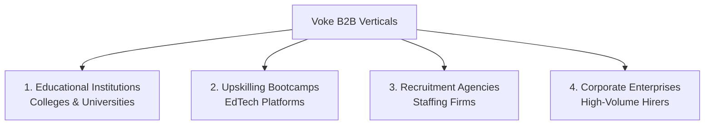

# Voke B2B GTM Strategy & Playbook

This document outlines the strategic blueprint to transition **Voke** from a consumer-centric (B2C) model (such as the micro-payment ₹99/session tier) into a high-margin, scalable **Business-to-Business (B2B)** platform.

---

## 1. Executive Summary & Core Pivot

To transition to B2B, the value proposition of Voke shifts from an individual focus to an institutional ROI focus:

*   **B2C Value Proposition:** "Practice interviews with AI to boost your confidence and land your dream job."
*   **B2B Value Proposition:** "Scale mock interviews infinitely, save hours of manual coordination/mentorship, and drive placement rates or candidate screening efficiency."

---

## 2. Core Target Verticals



### 🏛️ Vertical 1: Universities & Colleges (Campus Placement Cells)
*   **Target Persona:** Training & Placement Officers (TPOs), Deans of Career Services.
*   **The Problem:** TPOs are under massive pressure to achieve 100% placements. However, they lack the resources to give personalized feedback and conduct mock interviews for hundreds/thousands of students.
*   **Voke Solution:** Unlimited, automated video/voice mock interviews with real-time analytics.
*   **Value Pitch:** *"Boost your campus placement rate by 25% by training students at scale, while cutting down TPO workload by 80%."*

### 💻 Vertical 2: Upskilling Bootcamps & EdTech Platforms (e.g., Scaler, Masai)
*   **Target Persona:** Head of Operations, Placement Director, Career Services Lead.
*   **The Problem:** Bootcamps compete on high placement rates. Employing human mock interviewers/mentors is one of their largest operational bottlenecks and variable costs.
*   **Voke Solution:** Embed Voke as the primary self-diagnose stage. Students only escalate to a human mentor once they cross a target AI score.
*   **Value Pitch:** *"Reduce career support mentor costs by 70% while providing instant, 24/7 interview prep."*

### 🤝 Vertical 3: Recruitment Agencies & Staffing Firms
*   **Target Persona:** Managing Partners, Head of Talent Acquisition.
*   **The Problem:** Recruiters waste dozens of hours calling candidates who look good on their resumes but have poor communication or weak technical capabilities.
*   **Voke Solution:** Pre-screening candidate filtration using AI video/voice responses.
*   **Value Pitch:** *"Automatically filter out the bottom 50% of applicants before booking a human recruiter's calendar."*

### 🏢 Vertical 4: Corporate Enterprises (High-Volume Graduate Hiring)
*   **Target Persona:** Talent Acquisition Directors, HR Leads.
*   **The Problem:** Large-scale hiring (e.g., freshers, customer service representatives) requires screening thousands of applications manually.
*   **Voke Solution:** White-labeled automated pre-screening portal integrated into their ATS.
*   **Value Pitch:** *"Standardize candidate pre-screening and reduce your time-to-hire by 70%."*

---

## 3. Product Packaging: B2C vs. B2B

To sell B2B, Voke must transition from individual accounts to an **Institutional Hub**:

| Feature | B2C (Consumer) | B2B (Institutional) |
| :--- | :--- | :--- |
| **Pricing Model** | Micro-payment (e.g., ₹99/month or ₹99/session) | **Bulk Annual License** (e.g., ₹200–₹500/seat/year) or **Recruiter Credits** |
| **Interface** | Dashboard for individual candidate tracking | **Admin Portal** for TPOs/Managers to track batch-wide analytics, progress, and weaknesses |
| **Customization** | Standard prep tracks | **Custom Tracks** (e.g., "TCS Prep Track", "Goldman Sachs Technical Track") matching visiting companies |
| **Integration** | Personal Resume & GitHub sync | **ATS & HRIS Integration** (Greenhouse, Lever, etc.) for recruitment workflows |
| **Branding** | Voke Branded | **White-labeling/Custom Subdomain** (e.g., `college.voke.ai`) |

---

## 4. Technical Architecture: Multi-Tenancy

To support B2B, we need to extend the Supabase database schema to support organizations, members, and invite codes.

### 4.1 Database Migration Schema
The following tables are proposed to manage tenant isolation:

```sql
-- 1. Create Organizations Table
CREATE TABLE IF NOT EXISTS public.organizations (
    id UUID PRIMARY KEY DEFAULT gen_random_uuid(),
    name TEXT NOT NULL,
    domain TEXT UNIQUE, -- e.g. 'vit.edu' to auto-assign users by email domain
    logo_url TEXT,
    created_at TIMESTAMP WITH TIME ZONE DEFAULT timezone('utc'::text, now()) NOT NULL,
    status TEXT NOT NULL DEFAULT 'active' -- 'active', 'suspended'
);

-- 2. Link Profiles to Organizations
ALTER TABLE public.profiles
ADD COLUMN IF NOT EXISTS organization_id UUID REFERENCES public.organizations(id) ON DELETE SET NULL,
ADD COLUMN IF NOT EXISTS role TEXT NOT NULL DEFAULT 'candidate'; -- 'candidate', 'admin', 'evaluator'

-- 3. Create Invite Codes Table (for easy batch onboarding)
CREATE TABLE IF NOT EXISTS public.organization_invites (
    id UUID PRIMARY KEY DEFAULT gen_random_uuid(),
    organization_id UUID NOT NULL REFERENCES public.organizations(id) ON DELETE CASCADE,
    code TEXT UNIQUE NOT NULL, -- e.g. 'VIT2026'
    max_uses INTEGER,
    used_count INTEGER DEFAULT 0,
    expires_at TIMESTAMP WITH TIME ZONE,
    created_at TIMESTAMP WITH TIME ZONE DEFAULT timezone('utc'::text, now()) NOT NULL
);

-- 4. Enable Row Level Security (RLS) policies
ALTER TABLE public.organizations ENABLE ROW LEVEL SECURITY;

CREATE POLICY "Users can view their own organization details"
    ON public.organizations
    FOR SELECT
    USING (id = (SELECT organization_id FROM public.profiles WHERE id = auth.uid()));
```

---

## 5. B2B Admin Dashboard (UI Layout)

```
+---------------------------------------------------------------------------------------------------+
|  [Voke Logo]  College Portal: Vellore Institute of Technology                        [Log Out]    |
+---------------------------------------------------------------------------------------------------+
|  [Overview]    [Student List]    [Custom Interview Tracks]    [Settings]                          |
+---------------------------------------------------------------------------------------------------+
|                                                                                                   |
|  Summary Metrics                                                                                  |
|  +----------------------+ +----------------------+ +----------------------+ +------------------+  |
|  | Active Candidates    | | Avg. Practice Time   | | Mock Rounds Taken    | | Avg. Score       |  |
|  | 1,240                | | 4.2 Hours / Student  | | 3,892                | | 74% (Job Ready)  |  |
|  +----------------------+ +----------------------+ +----------------------+ +------------------+  |
|                                                                                                   |
|  Recent Student Activity                                                                          |
|  +---------------------------------------------------------------------------------------------+  |
|  | Student Name     | Email              | Track              | Score  | Status     | Actions  |  |
|  |------------------|--------------------|--------------------|--------|------------|----------|  |
|  | Aarav Patel      | aarav@vit.edu      | TCS Tech Round     | 82%    | Job Ready  | [Report] |  |
|  | Priya Sharma     | priya.s@vit.edu    | Amazon SWE Track   | 58%    | Needs Prep | [Report] |  |
|  | Kabir Singh      | kabir.k@vit.edu    | Consulting Round   | 71%    | Job Ready  | [Report] |  |
|  +---------------------------------------------------------------------------------------------+  |
|                                                                                                   |
+---------------------------------------------------------------------------------------------------+
```

---

## 6. Go-To-Market (GTM) Strategy

### Phase 1: The "Trojan Horse" (Student-Led Institutional Sale)
1.  **Identify Active Hubs:** Track where your existing paying consumers (the ₹99 users) are studying or working.
2.  **Pitch the TPO:** Once 30–50 students from a particular campus (e.g., *VIT*, *SRM*, *LPU*) sign up organically, reach out to the TPO.
3.  **The Hook:** *"Dozens of your students are already using Voke to prep for placements. We can license this campus-wide for ₹199/student/year so the entire batch of 3,000 can practice."*

### Phase 2: The "Free Pilot" Strategy
1.  **The Offer:** Reach out to TPOs or Bootcamp Directors and offer a **14-day free trial** or **50 free seats** for their elite/placement-ready batch.
2.  **The Demo:** Have them upload their resumes and try the AI voice/video mock interviews.
3.  **The Closing Analytics:** At the end of the trial, present the TPO with a detailed report showing which students are job-ready and who has specific communication/technical weaknesses. The data-driven insight makes the institutional sale a no-brainer.

### Phase 3: Self-Serve Recruiter SaaS
1.  Add a "Recruiters" tab to the Voke landing page.
2.  Allow recruitment agencies to sign up, purchase credit packs (e.g., 100 candidate screenings for ₹10,000), and create custom interview evaluation templates.

---
